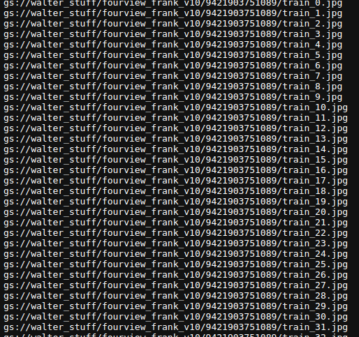

[TOC]


# ENV

```bash
conda create --name ai python=3.8
conda activate ai
pip install -r requirements.txt
```

# Data


## common

### Bayer -> jpg

`bayer_to_jpg_mp.jpg`

* -r root dir 
* -o output path 
* -c camera position 
  * given a filename 9300633119010_1692655960542_4302751_6_00_0130.jpg
  * barcode_timestamp_time_camera_round_seq.jpg
  * bayer_name.split("_")[cam_pos]
  * The cam_pos is 3

```bash
{
python3 common/bayer_to_jpg_mp.py \
    -r="/home/walter/big_daddy/imagr_instore_v5/onboarding_data_200_skip1_180324_3" \
    -g="/*/*/*/*/*.bayer" \
    -o="/home/walter/big_daddy/imagr_instore_v5/jpgs_isp3_3" \
    -c=2
}
```

### JPG -> Blackout 

```python
imgs = glob.glob(f"{images_root}{pattern}")
# ED_170823_IN_4_1692241027287_7807775_1_00_2329.jpg
# cam_pos is the index to where the cam id is
cam_id = basename.split("_")[cam_pos]
```


```bash
{
python3 common/blackout_imgs.py \
    --images_root="/home/walter/big_daddy/walter_stuff/test_od_jpg" \
    --pattern="/*.jpg" \
    --save_root="/home/walter/big_daddy/walter_stuff/test_od_jpg_blackout" \
    --cam_pos=4
}
```


# Object Detection

## Shopping

### jpg -> cvat -> labels (yolo)

1. unzip labels files 

* to single folder 

```bash
{
    python3 od/unzip_labels.py \
        --root="/home/walter/Downloads" \
        --output="/home/walter/Downloads" \
        --folder
}
```

* keep the folder structure

```bash
{
    python3 od/unzip_labels.py \
        --root="/home/walter/Downloads" \
        --output="/home/walter/Downloads"
}
```

1.998 + 0.785 * 3.476

### remove empty labels and jpgs

```bash
{
    python3 od/remove_empty_labels_jpg.py \
        --images_root="/home/walter/Downloads/stack_green/test/cam0" \
        --labels_root="/home/walter/Downloads/stack_green/test/cam0" \
        --pattern="/*.txt"
}
```

### find mis target 

```bash
{
    python3 od/find_mis_target.py \
        --images_root="/home/walter/nas_cv/walter_stuff/raw_data/dataset/images" \
        --labels_root="/home/walter/nas_cv/walter_stuff/raw_data/dataset/labels" \
        --pattern="/*.txt"
}
```


### create tfrecord


## Onboard

### Crop

In the yolov5 repo  https://github.com/IMAGR-LTD/yolov5

```bash
{
python3 batch_inf.py \
    --image_root='/home/walter/big_daddy/new_office_classifier_data' \
    --save_root='/home/walter/big_daddy/new_office_classifier_crop' \
    --render_root='/home/walter/big_daddy/new_office_classifier_render' \
    --weights='/home/walter/nas_cv/walter_stuff/saved_models/labeller/labeller_yolov5x12/weights/best.pt' \
    --batch_size=1024 \
    --gpus "cuda:1"
}
```

### Find bad barcode 

```bash
for i in *; do
  count=$(ls "$i"/* 2>/dev/null | wc -l)
  if [ "$count" -lt 300 ]; then
    echo "$i" >> /home/walter/directories.txt
  fi
done
```

### Copy bad barcode for training 

```bash
# Create a new directory to store the copied images
mkdir /home/walter/new_dir

# Read each line (barcode) from directories.txt and copy the .jpg files
while IFS= read -r barcode; do
  cp "$barcode"/*/*.jpg /home/walter/new_dir/
done < /home/walter/directories.txt
```


# Classification

### jpg -> pysot -> crop 

refer to https://github.com/IMAGR-LTD/yolov5   `README_IMAGR.md`

```bash
# clone the repo 
git clone git@github.com:IMAGR-LTD/yolov5.git
# install the deps
conda create --name yolov5 python=3.8
pip install -r requirements.txt  
# copy some trained models 
cp -r ~/nas_cv/walter_stuff/git/yolov5-master/new_office_onboard . 
# run the commands
{
python3 batch_inf.py \
    --image_root='/home/walter/big_daddy/walter_stuff/onboard/jpg' \
    --save_root='/home/walter/big_daddy/walter_stuff/onboard/new_crops' \
    --weights='/home/walter/nas_cv/walter_stuff/saved_models/onboard/onboard3/weights/best.pt' \
    --batch_size=128 \
    --gpus "cuda:0" "cuda:1" "cuda:2" "cuda:3"
}
```


### crop -> fourview

```bash
{
	python3 classification/build_fourview.py \
		--crop_in="/home/walter/nas_cv/walter_stuff/raw_data/crops" \
		--fourview_out="/home/walter/nas_cv/walter_stuff/raw_data/fourview" \
		--train_num=400 \
		--val_num=80 \
		--is_shuffle_patchify \
		--augmented_val
}
```

```bash
{
	python3 classification/build_fourview.py \
		--crop_in="/home/walter/big_daddy/walter_stuff/onboard/crops" \
		--fourview_out="/home/walter/big_daddy/walter_stuff/onboard/fourview_cv2" \
		--train_num=400 \
		--val_num=80 
}
```

### Triangle fourview 

```bash
{
	python3 classification/triangle_fourview.py \
		--crop_in="/home/walter/big_daddy/walter_stuff/onboard/crops" \
		--fourview_out="/home/walter/nas_cv/walter_stuff/raw_data/fourview_vvv3" \
		--train_num=800 \
		--val_num=160
}
```

### Triangle fourview val cam0

```bash
{
python3 classification/triangle_fourvie_val_cam0.py \
    --crop_in="/home/walter/big_daddy/walter_stuff/onboard/crops" \
    --fourview_out="/home/walter/nas_cv/walter_stuff/raw_data/fourview_cam0_val" \
    --train_num=800 \
    --val_num=160
}
```


### Triangle threeview

```bash
{
python3 classification/triangle_threeview.py \
    --crop_in="/home/walter/big_daddy/walter_stuff/onboard/crops" \
    --fourview_out="/home/walter/nas_cv/walter_stuff/raw_data/cls_3view_5" \
    --train_num=400 \
    --val_num=80
}
```

```bash
{
python3 classification/three_view_no_aug.py \
    --crop_in="/home/walter/big_daddy/walter_stuff/onboard/crops" \
    --fourview_out="/home/walter/nas_cv/walter_stuff/raw_data/three-view" \
    --train_num=15 \
    --val_num=0
}
```


### fourview -> tfrecord 

### Multi processing 

```bash
{
python3 classification/make_tfrecord.py \
    --datadir="/home/walter/nas_cv/walter_stuff/raw_data/cls_3view_5" \
    --outdir="/home/walter/nas_cv/walter_stuff/raw_data/cls_3view_5-tfrecord"
}
```


1. upload all fourview to a gcloud bucket `gs://walter_stuff/fourview/`

**train_val_txt**

```bash
{
	python3 classification/train_val_txt.py \
		--input="/home/walter/nas_cv/walter_stuff/raw_data/tri_fourview_v2" \
		--output="/home/walter/nas_cv/walter_stuff/raw_data/train_val_tri_v2" \
		--bucket="gs://walter_stuff/tri_v2/fourview"
}
```
2. create train val txt file and upload to gcloud bucket  `gs://walter_stuff/train_val_txt/`

```bash
gsutil cp /home/walter/big_daddy/walter_stuff/onboard/train_val_cv2/* gs://walter_stuff/11_oct/train_val_txt/
```

in short we just need and train.txt and val.txt pointing all the tfrecord on gcloud 



3. Run the dataflow to generate tfrecord 

**dataflow**

```bash dataset='coral'
train_val='gs://walter_stuff/tri_v2/train_val_txt'
output='gs://walter_stuff/tri_v2/tfrecord'
gcloud dataflow flex-template run "perclass-tfrecords-$(date +%Y%m%d%H%M%S)" \
  --project=imagr-ml-pipeline-development \
  --template-file-gcs-location "gs://imagr-ml-deploy/dataflow_templates/perclass_tfrecords/1/perclass_tfrecords_template.json" \
  --parameters customer=new_office \
  --parameters dataset=$dataset \
  --parameters dataset-version=1.0.0 \
  --parameters output=$output \
  --parameters train_input=$train_val"/train.txt" \
  --parameters val_input=$train_val"/val.txt" \
  --parameters num-shards=1 \
  --parameters val-num-shards=1 \
  --region "us-central1" \
  --staging-location gs://walter_stuff/.dataflow/staging/ \
  --worker-machine-type=n1-standard-1
